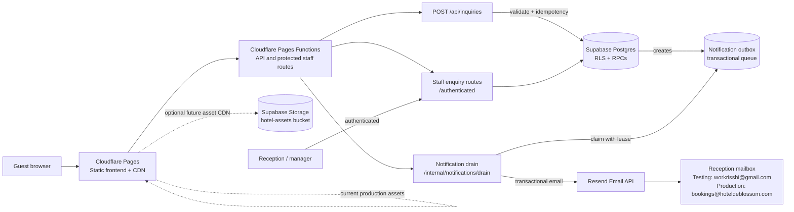
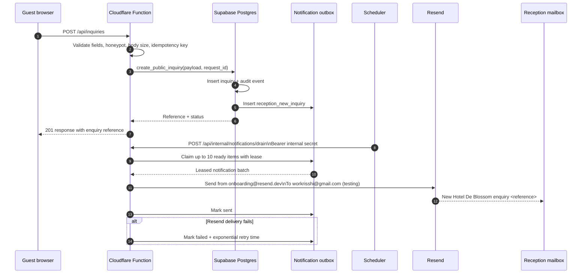

# Hotel De Blossom — technical architecture

This is the fixed-scope production architecture for the hotel website and enquiry workflow. It deliberately excludes live availability, payments, and PMS integrations.

## Technical topology



### Responsibilities

| Layer | Responsibility |
| --- | --- |
| Cloudflare Pages | Serves the frontend and static assets from the edge. |
| Pages Functions | Handles validation, rate-sensitive API work, staff API routes, and the protected notification drain. |
| Supabase Postgres | Stores enquiries, notes, audit events, staff profiles, and the notification outbox. |
| Supabase RLS/RPCs | Keeps public creation narrow while staff and server operations remain controlled. |
| Supabase Storage | Provisioned `hotel-assets` bucket for future public hotel media; current deployed media remains in Pages assets. |
| Resend | Sends reception notifications. No customer email is sent in the initial scope. |

## Enquiry-to-email line diagram



## Production switch after acceptance

Only the email routing changes:

```text
Testing:    onboarding@resend.dev  ->  workrisshi@gmail.com
Production: verified hotel sender  ->  bookings@hoteldeblossom.com
```

The database schema, API contract, outbox, retry logic, and deployment topology remain unchanged.

